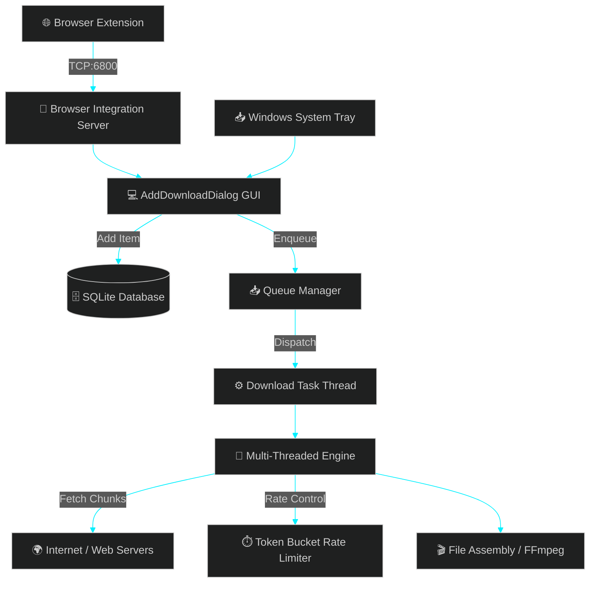

<p align="center">
  
</p>

<p align="center">
  
</p>

<p align="center">
  <strong>A high-performance, multi-threaded desktop download manager with native browser integration, real-time speed throttling, and unlimited quality video extraction.</strong>
</p>

<p align="center">
  
  
  
  
</p>

<p align="center">
  
  
  
</p>

---

## 
- [💎 Key Features](#-key-features)
- [⚡ Quick Installation](#-quick-installation)
- [🌐 Browser Extension](#-browser-extension)
- [🏗️ Architecture](#️-architecture)
- [📂 Directory Structure](#-directory-structure)
- [🛠️ Developer Setup](#️-developer-setup)
- [❓ Troubleshooting](#-troubleshooting)

---

## 

-  **Multi-Threaded Acceleration:** Splits downloads into multiple concurrent connection chunks, bypassing server throttling to saturate your bandwidth!
-  **Unlimited Video Resolutions:** Unlike standard downloaders, Velocity auto-stitches high-resolution video streams with separate HQ audio using pre-packaged **FFmpeg**.
-  **Speed Throttling:** Throttle your download speed in real-time using a custom-built token-bucket rate limiter.
-  **Smart File Categorization:** Auto-routes downloaded files into organized subfolders (`Video`, `Audio`, `Documents`, `Compressed`, `Programs`).
-  **Browser Interceptor:** Integrates directly with your browser to automatically capture download links!
-  **Windows Native:** Minimizes to System Tray, registers on startup, and supports auto-shutdown upon completion.

---

## 

> [!TIP]
> **No installation dependencies required!** The standalone package includes Python runtimes, UI kits, and video merging binaries out of the box.

1. **[Download Velocity_Setup.exe](./Velocity_Setup.exe)** directly from this repository.
2. Double-click the downloaded `Velocity_Setup.exe` file.
3. Follow the Setup Wizard instructions to choose your custom installation path and create a desktop shortcut.
4. Click **Launch Velocity** when the installer finishes!

---

## 

> [!IMPORTANT]
> **Developer Mode must be enabled** in your browser settings to load the unpacked extension folder.

1. **[Download Velocity_Extension.zip](./Velocity_Extension.zip)** and extract it to a permanent folder on your computer.
2. Open any Chromium-based browser (Google Chrome, Microsoft Edge, Brave, etc.).
3. Navigate to the Extensions panel (`chrome://extensions/` or `edge://extensions/`).
4. Toggle the **Developer Mode** switch in the top-right corner.
5. Click the **Load unpacked** button in the top-left.
6. Select the folder where you extracted the extension.
7. *Done!* The extension will now communicate silently with the Velocity local server on port `6800`.

---

## 



---

## 

```directory
.
├── browser_extension/        # Browser extension source code (interceptor)
├── download_manager/         # Main desktop application Python package
│   ├── database/             # Database initialization and queries
│   ├── downloader/           # Multi-threaded download algorithms & engines
│   ├── gui/                  # Theme configurations and CustomTkinter layouts
│   ├── models/               # SQLite DB schemas and data structures
│   ├── services/             # TCP socket server, settings manager, registries
│   ├── utils/                # Standard helper modules
│   ├── app.py                # Main application entry point
│   └── velocity.ico          # Application branding icon
├── tools/                    # Developer tools and build pipelines
│   ├── build.py              # Compiles main payload (Velocity.exe)
│   ├── build_installer.py    # Packages app and assets into Setup Wizard (Velocity_Setup.exe)
│   ├── extract_yt_dlp_imports.py # Dependency scanning engine for PyInstaller
│   ├── install_ffmpeg.py     # Script to automate local FFmpeg installations
│   └── installer_app.py      # Tkinter code for the Setup Wizard GUI installer
├── .gitignore                # Custom ignore parameters for Python / PyInstaller
├── LICENSE                   # Standard MIT License
├── README.md                 # Product documentation
├── requirements.txt          # Python runtime requirements list
├── Velocity_Extension.zip    # Pre-packaged browser extension for direct download
└── Velocity_Setup.exe        # Pre-compiled standalone installer for direct execution
```

---

## 

> [!NOTE]
> Make sure to install FFmpeg using our setup script if you're running the source code directly. High-resolution stream merging requires it.

### Prerequisites:
- **Python 3.10+** installed on your system.
- **Git** to clone the repository.
- **FFmpeg** binaries (`ffmpeg.exe`, `ffprobe.exe`) placed in the `download_manager/` directory. You can run our automated utility:
  ```bash
  python tools/install_ffmpeg.py
  ```

### Steps:
1. **Clone the repository:**
   ```bash
   git clone https://github.com/yourusername/velocity-download-manager.git
   cd velocity-download-manager
   ```
2. **Create and activate a virtual environment:**
   ```bash
   python -m venv .venv
   # Windows:
   .venv\Scripts\activate
   # macOS/Linux:
   source .venv/bin/activate
   ```
3. **Install dependencies:**
   ```bash
   pip install -r requirements.txt
   ```
4. **Launch the application:**
   ```bash
   python -m download_manager.app
   ```

---

## 

> [!WARNING]
> If you close the desktop client or block port `6800`, the browser extension will show connection errors.

#### Q: The Chrome extension doesn't catch my downloads. How do I fix it?
Make sure Velocity is currently running in your system tray. The extension relies on a TCP server listening on port `6800`. If Velocity is closed or blocked by Windows Firewall, the extension won't be able to forward downloads.

#### Q: Why are YouTube downloads failing to merge?
Ensure `ffmpeg.exe` and `ffprobe.exe` are present in your application root folder. If you installed via `Velocity_Setup.exe`, they are already pre-bundled. If running from source, execute `python tools/install_ffmpeg.py` to acquire them automatically.

#### Q: Can I run Velocity on Linux/macOS?
Velocity has been built with native Windows integrations (Registry hooks for startup, taskkill subprocesses, and custom chimes). While the GUI and core engine can run on other platforms, certain OS-specific utilities are optimized for Windows environment deployment.

---

## 
This project is licensed under the MIT License - see the [LICENSE](LICENSE) file for details.
